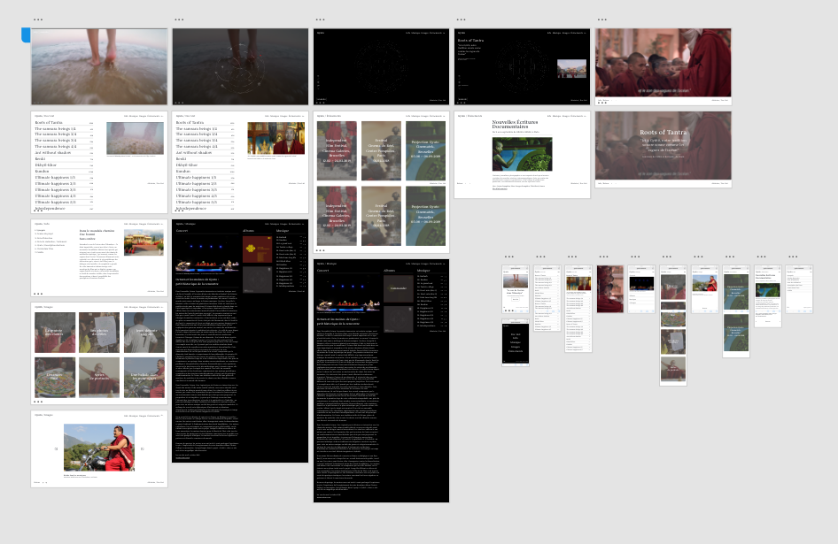

# Gyuto
### Web app for a film documentary by Filipa Cardoso.

> « To hear the sound of the ocean in the Himalayas… This unlikely wish takes a film director and her three curious girls to Gyuto, a Tibetan Buddhist monastery echoing day and night the sacred tantric chants of meditation, which the monks say, “sound like the waves of the ocean" » 

[VOIR SITE V1](http://gyuto-movie.com/)

## TODO v2
1. **Création d'une plateforme d'admin du site + base de données.** [VOIR MOCKUP BACKEND](assets/back-end/wire_frames-backend.pdf). La première version du backend a été réalisé par Liliane Mamane en Laravel, mais pas terminé. Au choix de continuer son travail ou de refaire dans un autre stack.

1. **Fetch data dans l'ensemble des composants react où le fichier `data.js` est importé.** Faire appel au json généré par le backend (fr / en) dans le `componentDidMount` de ces mêmes composants.

1. **Switcher les langues du site.** Le switch des langues a été réalisé pour les navigations grâce à la librarie `i18next`. Avec cette même librarie faudrait appeler les json (fr / en) dans le `fetch` pour afficher les données dans le bon langage. Le switch des langues se trouve dans le composant `Navigation.jsx` (components/navBar/assets/Navigation.jsx), désactivé, en mode commentaires.

***Pour continuer le projet, faudrait merger la branche master avec votre nouvelle branche.***

## Ressources

- [Mockup Front-end](assets/front-end/prototype.xd)
- [Mockup Back-end](assets/back-end/wire_frames-backend.pdf)
- [Data.js](assets/back-end/data.js)
- [Back-end Laravel](https://github.com/lilianem/gyuto)
- [Base de données SQL](assets/back-end/gyuto.sql)

## Architecture

## Mockup

## Config
- NPM version 6.4
- PHP version 7.2
- LARAVEL 5.6
- SASS

## Crédits Developpement v1

- **Front-end Development:** 
[Baptiste Firket](https://github.com/baptistefkt), [Pedro Seromenho](https://pedroseromenho.com/) & [Geoffrey Poelmans](https://github.com/geoffrey-poelmans)

- **Back-end Development:**
[Liliane Mamane](https://github.com/lilama)

- **Mandala Development:**
[Geoffrey Poelmans](https://github.com/geoffrey-poelmans)

- **UX/UI Design:**
[Pedro Seromenho](https://pedroseromenho.com/)

## Crédits Généraux

- **Typeface:** 
Begum, designed by Manushi Parikh, [Indian Type Foudry](https://www.indiantypefoundry.com/)

- **Illustrations:** 
Mandala designed by [Firma 103](https://www.103.be/) 
& Shrivatsa designed by [Alexandre Plennevaux](https://pixeline.be/)

- **Technologies:**
React, Laravel, GSAP, JQuery

Projet created at [Becode coding school](https://becode.org).
Thanks to Bertrand Marlair for his help with React Environment.

##### With :heart: from us, at [becode]() oct-nov 2018.

